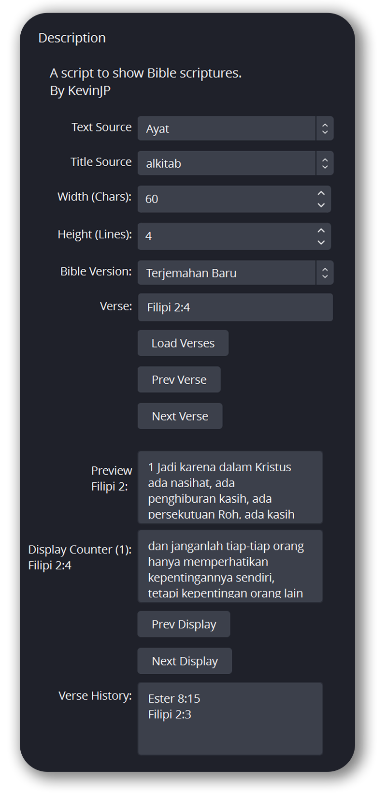

# Bible OBS Script

OBS Script to show bible scriptures that is fetched from Alkitab-API (by [sonnylazuardi](https://github.com/sonnylazuardi/alkitab-api))
<>

## Installation

- Install BeautifulSoup python package
- Install requests python package
- Download biblescript.py
- On OBS top bar, click Tools and then click Scripts
- Click the plus sign to add the script, and locate the biblescript.py, then click Open

## Usage

- You need to add text source and title source to your scene
- Then on the script, you have to select text source and title source that will show the scriptures
- You have to select the bible version too, the available versions are: Terjemahan Baru, New Kings James Version, New International Version, New English Translation, and Authorized Version
- Then, select the book, chapter, and verse
- To show the selected scripture, click the "Load Verses" button. You need to click this button every time you want to show another book or chapter
- To show previous or next verse you can click "Prev Verse" and "Next Verse" button
- The "Preview Chapter" text box will show all the verse of the loaded chapter
- The "Display" text box will show the displayed verse on the text source and the number of partitioned verse besides "Display"
- You can click the "Prev Display" and "Next Display" button to show the previous or next partitioned verse. If the number of partitioned verse is equal to 1, the verse won't change when you click this button
- You can choose the maximum width per lines and maximum lines shown in The "Width" and "Height" input field

## License

[MIT](https://choosealicense.com/licenses/mit/)
